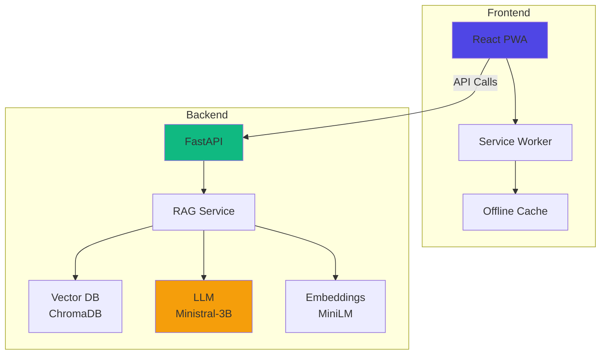

# PRAGATI - Personalized Rapid Adaptive Growth And Training Intelligence

[](https://opensource.org/licenses/MIT)
[](https://www.python.org/downloads/)
[](https://reactjs.org/)

> **AI-Powered Educational Platform for Teacher Training**  
> Transforming static training manuals into personalized, micro-learning modules for teachers in resource-constrained environments.

## 🎯 Problem Statement

Current teacher training systems face critical challenges:
- **Static Content**: One-size-fits-all manuals updated every 3-4 months
- **Low Relevance**: Generic training doesn't address specific classroom challenges
- **Poor Accessibility**: Limited vernacular language support for rural teachers
- **No Feedback Loop**: Zero tracking of implementation effectiveness

## 💡 Our Solution

PRAGATI leverages **RAG (Retrieval Augmented Generation)** to create:
- ✅ **Personalized Micro-Learning**: 15-minute modules tailored to specific challenges
- ✅ **Vernacular Support**: Multi-language translation (Hindi, Bengali, Tamil, Telugu, Marathi)
- ✅ **Offline-First PWA**: Works on 2G/3G connectivity
- ✅ **Implementation Tracking**: Feedback loop to measure real-world impact

## 🏗️ Architecture



## 🚀 Quick Start

### Prerequisites
- Python 3.11+
- Node.js 20+
- Ollama (for local LLM)

### Installation (Local Development)

#### Backend Setup

```bash
cd backend

# Create virtual environment
python -m venv venv
source venv/bin/activate  # Windows: venv\Scripts\activate

# Install dependencies
pip install -r requirements.txt

# Copy environment file
cp .env.example .env

# Install and start Ollama (https://ollama.ai)
ollama pull ministral:3b

# Run the backend
python main.py
```

#### Frontend Setup

```bash
cd frontend

# Install dependencies
npm install

# Start development server
npm run dev
```

### Docker Deployment (Experimental)

> **Note:** Docker support is currently experimental and has not been fully tested.

```bash
docker-compose up --build
```

## 📚 Usage

### Generate Micro-Learning Module

1. Open the frontend at `http://localhost:5173`
2. Enter a classroom challenge (e.g., "Students in my class have varying learning speeds")
3. The AI will generate a personalized 15-minute micro-learning module.

```bash
# API Equivalent
curl -X POST http://localhost:8000/api/generate \
  -H "Content-Type: application/json" \
  -d '{
    "challenge": "Students in my class have varying learning speeds",
    "target_duration": 15,
    "difficulty_level": "intermediate"
  }'
```

## 🛠️ Tech Stack

### Backend
- **Framework**: FastAPI
- **LLM**: Ollama (Ministral-3B)
- **Embeddings**: sentence-transformers (all-MiniLM-L6-v2)
- **Vector DB**: ChromaDB
- **Document Processing**: PyPDF2, pdfplumber

### Frontend
- **Framework**: React 18 + Vite
- **PWA**: vite-plugin-pwa + Workbox
- **Styling**: Tailwind CSS
- **Animations**: Framer Motion
- **Icons**: Lucide React
- **HTTP Client**: Axios

### DevOps
- **Containerization**: Docker (Experimental)

## 📁 Project Structure

```
pragati/
├── backend/
│   ├── api/                 # API routes
│   ├── models/              # Pydantic schemas
│   ├── services/            # Business logic
│   │   ├── rag_service.py
│   │   ├── llm_service.py
│   │   ├── embedding_service.py
│   │   ├── translation_service.py
│   │   └── micro_learning_service.py
│   ├── utils/               # Utilities
│   │   ├── document_processor.py
│   │   └── vector_store.py
│   ├── main.py              # FastAPI app
│   ├── config.py            # Configuration
│   └── requirements.txt
├── frontend/
│   ├── src/
│   │   ├── components/      # React components
│   │   ├── services/        # API client
│   │   ├── App.jsx
│   │   └── main.jsx
│   ├── package.json
│   └── vite.config.js
├── docker-compose.yml
└── README.md
```

## 🎓 Key Features

### 1. RAG Pipeline
- **Document Ingestion**: Automatic PDF parsing and chunking
- **Semantic Search**: Vector similarity search using embeddings
- **Context-Aware Generation**: LLM generates content from retrieved chunks

### 2. Micro-Learning Engine
- **Challenge-Based**: Modules tailored to specific classroom problems
- **Time-Bound**: 15-minute actionable sessions
- **Structured Output**: Sections with activities and implementation tips

### 3. Vernacular Translation
- **Multi-Language**: Support for 6+ Indian languages
- **Batch Translation**: Efficient translation of module sections
- **Fallback Handling**: Graceful degradation if translation fails

### 4. Offline-First PWA
- **Service Worker**: Caches API responses and static assets
- **Background Sync**: Queues requests when offline
- **Install Prompt**: Add to home screen capability

## 🧪 Testing

```bash
# Backend tests
cd backend
pytest tests/ -v --cov

# Frontend tests
cd frontend
npm test
```

## 📊 Performance

- **Module Generation**: ~5-10 seconds (depends on LLM)
- **Translation**: ~2-3 seconds per section
- **Document Ingestion**: ~1 second per page
- **Vector Search**: <100ms for top-5 results

## 🤝 Contributing

We welcome contributions! Please see our [Contributing Guidelines](CONTRIBUTING.md).

1. Fork the repository
2. Create a feature branch (`git checkout -b feature/amazing-feature`)
3. Commit your changes (`git commit -m 'Add amazing feature'`)
4. Push to the branch (`git push origin feature/amazing-feature`)
5. Open a Pull Request

## 📄 License

This project is licensed under the MIT License - see the [LICENSE](LICENSE) file for details.

## 👥 Team Laplace

**Innovation for Education Equity Hackathon**

- Team Member 1 - Full Stack Engineer
- Team Member 2 - ML Engineer
- Team Member 3 - Frontend Developer
- Team Member 4 - Backend Developer

## 🙏 Acknowledgments

- SCERT for training manual resources
- Ollama for local LLM deployment
- HuggingFace for open-source models
- Meta for NLLB translation models

## 📞 Support

For questions or support, please open an issue on GitHub or contact us at [email@example.com](mailto:email@example.com).

---

**Built with ❤️ for teachers transforming education**
